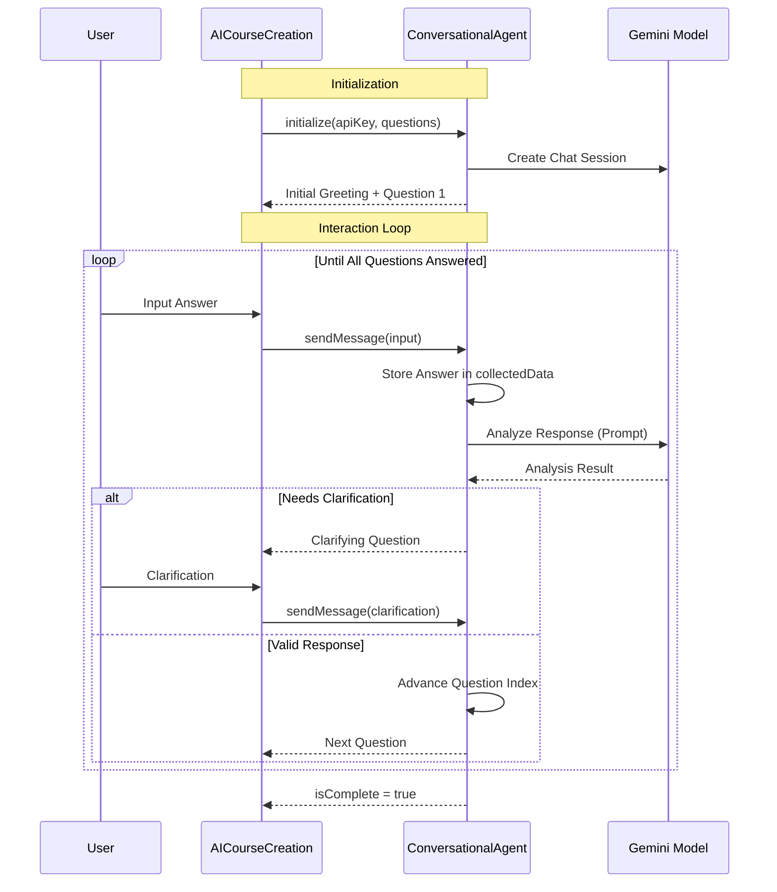
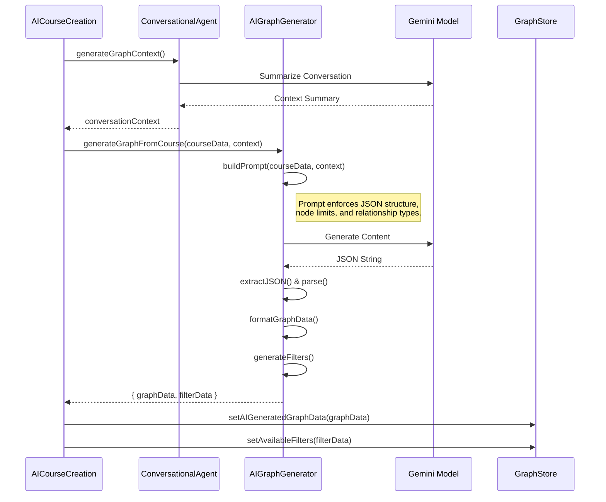
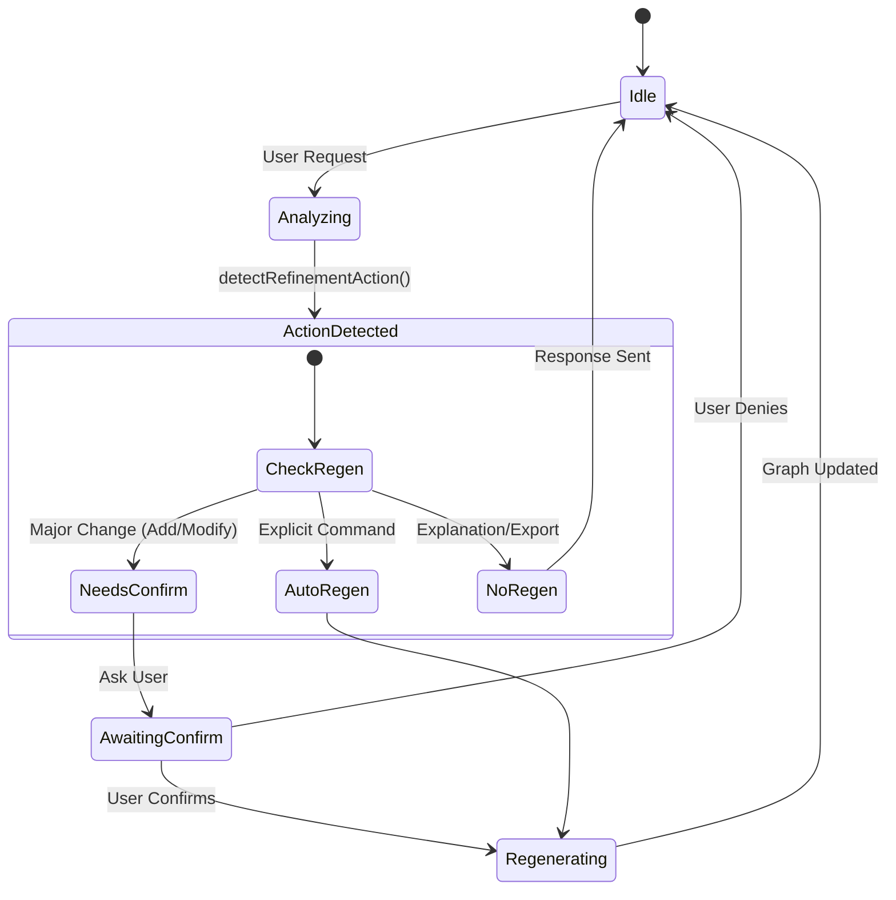

# AI Course Generation Architecture & Flow

This document provides a comprehensive technical overview of the AI-powered course generation system in Tangible PBL. It details the interaction between the UI, the Conversational Agent service, and the AI Graph Generator service.

## 1. System Architecture Overview

The course generation system is built on a conversational interface that gathers requirements from the educator and transforms them into a structured knowledge graph.

```mermaid
graph TD
    User[Educator] <--> UI[AICourseCreation UI]
    UI <--> Agent[ConversationalAgent Service]
    Agent <--> Gemini[Google Gemini API]
    UI --> Generator[AIGraphGenerator Service]
    Generator --> Gemini
    Generator --> Store[GraphStore (Zustand)]
    
    subgraph "Data Flow"
        Agent -- "Context Summary" --> Generator
        UI -- "Structured Course Data" --> Generator
        Generator -- "Graph Data (Nodes/Edges)" --> Store
    end
```

## 2. Detailed Process Flow

The generation process is divided into three distinct phases: **Data Collection**, **Graph Generation**, and **Refinement**.

### Phase 1: Interactive Data Collection

In this phase, the `ConversationalAgent` drives a chat-based interface to collect structured data while simultaneously building a rich context of the user's intent.

**Key Components:**
*   `AICourseCreation.tsx`: Manages the chat UI state.
*   `ConversationalAgent.ts`: Manages the conversation logic and state.

**Flow Diagram:**



**Technical Details:**
*   **Prompt Engineering**: The agent uses a meta-prompt to analyze user responses. It checks for clarity and completeness before accepting an answer.
*   **State Management**: The agent maintains `collectedData` (structured) and `conversationHistory` (unstructured context).

### Phase 2: AI Graph Generation

Once data collection is complete, the system transitions to generating the skill graph. This combines the structured form data with the unstructured conversation nuances.

**Key Components:**
*   `AIGraphGenerator.ts`: Handles the prompt construction and JSON parsing.
*   `GraphStore`: Global state for the application.

**Flow Diagram:**



**Data Structure (GraphData):**
The AI is instructed to return data in this specific format:
```typescript
interface GraphData {
  nodesCount: number;
  relationshipsCount: number;
  nodes: Array<{
    id: string; // "0", "1", ...
    labels: ["Skill"];
    properties: {
      level: "Awareness" | "Application" | "Mastery" | "Influence";
      name: string;
      source: string; // Course Title
      category: string;
    };
  }>;
  relationships: Array<{
    id: string;
    type: "PREREQUISITE" | "PART_OF" | "SPECIALIZES" | ...;
    start: string; // Node ID
    end: string;   // Node ID
    properties: Record<string, unknown>;
  }>;
}
```

### Phase 3: Interactive Refinement

After the initial graph is generated, the user can refine it through the chat interface. This allows for iterative improvements without restarting the process.

**Flow Diagram:**



**Refinement Logic:**
The `ConversationalAgent` analyzes requests to categorize them:
*   `add_skills`: User wants to expand the scope. -> **Requires Regeneration**
*   `modify_depth`: User wants to change difficulty distribution. -> **Requires Regeneration**
*   `adjust_connections`: User wants to change how nodes link. -> **Requires Regeneration**
*   `explain`: User has a question about the current graph. -> **No Regeneration**

## 3. Static Data Mode (Dev/Demo)

For development and demonstration purposes, the system supports a "Static Data Mode" that bypasses the AI generation.

**Implementation:**
*   **Trigger**: "Try with static demo data" button in `ApiKeySetup`.
*   **Action**: `handleLoadStaticData` in `AICourseCreation`.
*   **Source**: `src/data/nodes.json`.
*   **Behavior**: Simulates a 1-second delay and then loads the pre-defined JSON data directly into the `GraphStore`, allowing full UI functionality without an API key.

## 4. Error Handling

The system implements robust error handling for AI interactions:
*   **JSON Parsing Errors**: If the AI returns malformed JSON, the system attempts to extract the valid JSON substring.
*   **API Errors**: Handles 401 (Invalid Key), 429 (Quota Exceeded), and 503 (Service Overloaded) with user-friendly messages.
*   **Fallback**: In case of critical failures, the UI displays a `GraphErrorState` allowing the user to retry or check their settings.
